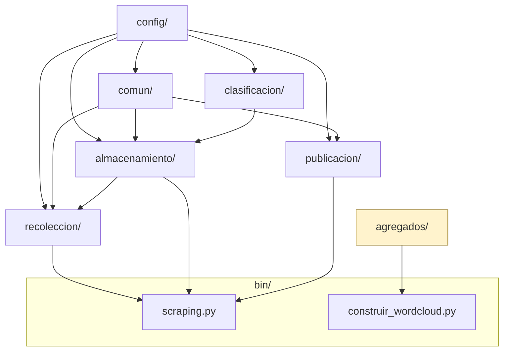
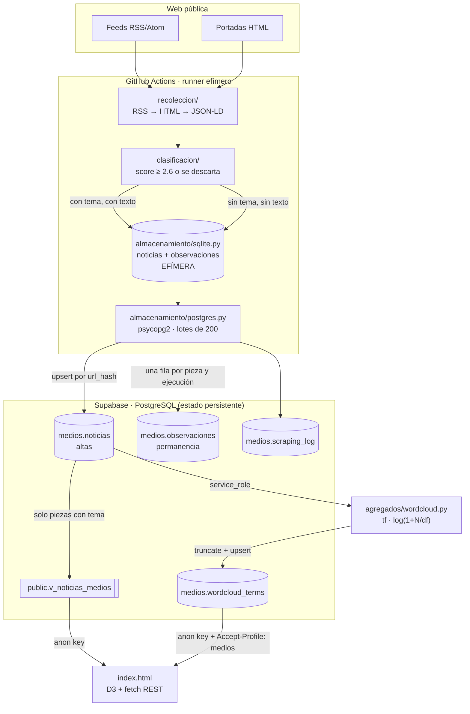

# Arquitectura de `medios-odesocan`

Índice de referencia del observatorio de medios canarios de ODESOCAN.
Escrito para leerse sin conocimiento previo del repositorio: describe qué hace
cada carpeta, cómo circulan los datos, qué vive dentro del repositorio y qué
vive fuera (Supabase, GitHub Actions).

El código está organizado por capas. Las referencias son a **módulo y función**,
no a números de línea, para que no caduquen al editar.

---

## 1. Qué es este proyecto en una frase

Un **pipeline de observación de prensa**: cada día raspa 17 cabeceras canarias
—doce diarios digitales, dos agencias y la radiotelevisión pública—,
clasifica cada noticia en 15 temas de política social mediante un clasificador
híbrido (keywords + lemas + URL + similitud vectorial), vuelca lo nuevo a una
base PostgreSQL alojada en Supabase, y lo publica en un dashboard estático D3
servido por GitHub Pages que consulta esa base desde el propio navegador.

Un solo `git push` no despliega nada: **el repositorio es a la vez el código,
el planificador (cron de Actions) y el frontend**. La base de datos es el único
componente con estado y es externa.

---

## 2. El árbol, y por qué está así

```
medios-odesocan/
├── observatorio/           EL PAQUETE — una carpeta por capa del pipeline
│   ├── config/             qué se observa (medios, temas, parámetros, rutas)
│   ├── comun/              utilidades transversales (logging, texto)
│   ├── recoleccion/        de la web a un diccionario Python
│   ├── clasificacion/      de un diccionario a un conjunto de temas
│   ├── almacenamiento/     de la memoria a SQLite y de SQLite a PostgreSQL
│   ├── agregados/          la nube de palabras (pipeline independiente)
│   └── publicacion/        el dashboard (legado)
│
├── bin/                    PUNTOS DE ENTRADA — lo único que se ejecuta
├── db/                     esquema SQL versionado (esquema.sql + wordcloud.sql)
├── requirements/           dependencias, una lista por pipeline
├── .github/workflows/      los dos crons
│
├── index.html              el dashboard (1.319 líneas, autónomo)
├── README.md               estado operativo y decisiones
└── ARQUITECTURA.md         este documento
```

Tres decisiones de estructura que conviene entender antes de nada:

**`index.html` se queda en la raíz.** No es desorden: GitHub Pages publica desde
la raíz de la rama, así que moverlo a una subcarpeta cambiaría la URL del
dashboard ya publicado. Si algún día se quiere mover, hay que cambiar antes la
configuración de Pages en *Settings → Pages*.

**`bin/` está separado del paquete.** Un módulo de `observatorio/` se importa;
un script de `bin/` se ejecuta. Esa frontera es la que permite que
`observatorio/` no tenga efectos secundarios al importarse y que se pueda
probar cualquier pieza suelta desde un intérprete.

**`agregados/` no importa nada del resto.** Es deliberado: su workflow instala
solo `requirements/wordcloud.txt` (el paquete `supabase` y nada más), así que
un import hacia otra capa rompería ese pipeline en producción.

### El paquete, fichero a fichero

| Módulo | Contenido |
|---|---|
| **`config/`** | |
| `rutas.py` | `BASE_DIR`, `DATA_DIR`, `DB_PATH`, `CACHE_DIR`, `LOG_DIR`. Crea los directorios al importarse. |
| `medios.py` | `MEDIOS`: las 17 cabeceras, con feeds, selectores CSS y filtros de URL. |
| `temas.py` | `TEMAS`: los 15 temas con sus diccionarios de keywords y su `peso_titulo`. |
| `scraping.py` | `SCRAPER` (ritmo, timeouts, cuotas) y `USER_AGENTS` (12 navegadores). |
| `credenciales.py` | `SUPABASE`: conexión Postgres, todo por variable de entorno. |
| `stopwords.py` | `STOPWORDS_EXTRA`. **Nadie lo importa** — código muerto, ahora visible. |
| **`comun/`** | |
| `registro.py` | `configurar_logging(fichero=None)`. Antes había cuatro copias de esto. |
| `texto.py` | `url_hash()` (SHA-256 truncado a 16) y `limpiar_html()`. |
| **`recoleccion/`** | |
| `clientes.py` | `ClienteHTTP` (httpx + caché + reintentos), `ClientePlaywright` (Chromium), `_esperar()`, `_headers_navegador()`. |
| `rss.py` | `parsear_rss()`, `_normalizar_fecha()`. |
| `wp_json.py` | `parsear_wp_json()`: API REST de WordPress, para medios cuya portada mezcla noticias con programación. |
| `portada.py` | `parsear_html_portada()`, `_extraer_desde_jsonld_portada()`, `_url_html_permitida()`. |
| `articulo.py` | `extraer_articulo()`: texto y fecha de publicación de una sola descarga. |
| `fechas.py` | `fecha_desde_url()`, `fecha_desde_html()`, `mejor_que()`: la fecha real y su procedencia. |
| `orquestador.py` | `scrapear_medio()`, `scrapear_todos()`. |
| **`clasificacion/`** | |
| `pistas.py` | `EXTRA_THEME_HINTS` (lenguaje periodístico), `URL_THEME_HINTS` (secciones). |
| `normalizacion.py` | Carga de spaCy, `_normalizar()`, `_tokens_texto()`, `_segmentos_url()`. |
| `motor.py` | `SCORE_MINIMO`, `clasificar()`, `clasificar_detallado()`. |
| `version.py` | `version_clasificador()`: huella de lo que determina la clasificación. |
| **`almacenamiento/`** | |
| `sqlite.py` | Esquema local, `init_db()`, `guardar_noticia()`, `registrar_observacion()`, `ya_existe()`. |
| `postgres.py` | `sincronizar()`, `sincronizar_log()`, `sincronizar_observaciones()`, `actualizar_temas_vacios()`. |
| **`agregados/`** | |
| `wordcloud.py` | Todo el cálculo del agregado textual. No importa nada de `observatorio`. |
| **`publicacion/`** | |
| `dashboard.py` | `cargar_noticias()`, `construir_datos()`, `generar_html()`. Legado. |

### Los puntos de entrada

| Script | Qué hace | Quién lo llama |
|---|---|---|
| `bin/scraping.py` | Pipeline diario completo (raspado → sync → dashboard). Modo `--run-now` o daemon. | `scraping.yml` |
| `bin/construir_wordcloud.py` | Recalcula `medios.wordcloud_terms`. | `build-wordcloud.yml` |
| `bin/raspar.py` | Solo el raspado. `--medio`, `--dry-run`, `--lista-medios`. | a mano |
| `bin/sincronizar.py` | Solo la sincronización. `--limit`, `--dry-run`. Además lanza `actualizar_temas_vacios()`. | a mano |
| `bin/generar_dashboard.py` | Regeneración del HTML. Legado. | a mano |
| `bin/reclasificar.py` | Reetiqueta el corpus con la versión vigente del clasificador. | `reclasificar.yml`, a mano |

Cada script de `bin/` añade la raíz del repositorio a `sys.path`, así que
funciona desde cualquier directorio sin instalar el paquete.

### Grafo de dependencias



`agregados/` aparece aislado a propósito (en ámbar): es el pipeline paralelo.
Las flechas se leen «es importado por»: `config/` no importa a nadie, y todo lo
demás acaba desembocando en un script de `bin/`.

---

## 3. Flujo de datos completo



### El punto clave que hay que entender

**SQLite es efímera en producción.** `data/noticias.db` está en `.gitignore` y el
runner de Actions se destruye al terminar. Cada ejecución diaria arranca con una
base local **vacía**, raspa, clasifica, y sincroniza contra Supabase preguntando
primero qué `url_hash` ya existen allí (`postgres._hashes_en_supabase`). La
deduplicación real es contra Postgres, no contra la base local. En desarrollo
local, en cambio, la SQLite sí persiste entre ejecuciones y actúa como caché.

---

## 4. Las capas, en detalle

### 4.1 `recoleccion/` — de la web a un diccionario

Estrategia en cascada, de más fiable a más frágil:

0. **API REST de WordPress** (`wp_json.parsear_wp_json`) — cuando la portada
   mezcla noticias con programación, recetas y avisos corporativos en rutas que
   ningún filtro separa. Lo usa RTVC, y devuelve fecha de publicación real y las
   categorías propias del medio.
1. **RSS** (`rss.parsear_rss`) — doble intento: primero `feedparser` directo con
   cabeceras de navegador, y si falla o devuelve 0 entradas, `httpx` como
   respaldo. 7 de las 17 cabeceras tienen RSS utilizable.
2. **Portada HTML** (`portada.parsear_html_portada`) — selectores CSS definidos
   por medio en `config/medios.py`, con filtrado de URLs por regex.
3. **JSON-LD de la portada** (`portada._extraer_desde_jsonld_portada`) — red de
   seguridad: si los selectores CSS devuelven menos de la mitad de la cuota, se
   buscan bloques `ItemList` / `NewsArticle` en los datos estructurados. Esto es
   lo que salva al scraper cuando un medio cambia de plantilla.
4. **Texto completo y fecha real** (`articulo.extraer_articulo`) — de una sola
   descarga saca el cuerpo (`articleBody` de JSON-LD → `newspaper3k` →
   heurística con BeautifulSoup) y la fecha de publicación (`datePublished` →
   `<meta article:published_time>`). Solo se descarga **después** de que la
   noticia haya pasado el filtro temático, para no gastar peticiones en
   artículos que se van a descartar.

**Dos clientes HTTP intercambiables por duck-typing** (ambos exponen `.get(url)`),
en `clientes.py`:

- `ClienteHTTP` — `httpx` con caché en disco (`data/html_cache/`, TTL 7 días),
  reintentos exponenciales, rotación de 12 User-Agents y *stale-if-error*
  (sirve caché caducada antes de rendirse).
- `ClientePlaywright` — Chromium headless. Lo usa **un solo medio**:
  `canariasahora`, marcado con `playwright: True` en `config/medios.py`.

**El listado va sin recorte.** La portada se recorre entera: cuesta una sola
petición y es un objeto finito, justo la unidad que declara el cuaderno
metodológico. El tope (`max_articulos_por_medio`) está en la descarga de texto
completo, que sí cuesta una petición por pieza. Antes el recorte estaba al
revés, y además con cuotas desiguales entre cabeceras (20–30), lo que hacía
incomparables los volúmenes entre medios. Al quitarlo, Canarias7 pasa de 30
piezas por ejecución a unas 138, y El Día de 30 a 110.

**Cortesía deliberada**: pausas aleatorias de 1,5–5 s entre peticiones, con un
12 % de probabilidad de una pausa larga de 8–22 s que imita a un lector humano
(`clientes._esperar`). `robots.txt` está **desactivado** por decisión explícita
(`config/scraping.py`, `respetar_robots: False`): monitoreo académico, una
ejecución diaria, menos tráfico que un lector real. Es defendible, pero conviene
saberlo.

### 4.2 `clasificacion/` — de un diccionario a un conjunto de temas

No es un modelo entrenado: es un **sistema de puntuación híbrido con cuatro
señales**, todas sumando al mismo score por tema.

| Señal | Peso | Dónde |
|---|---|---|
| Keyword literal en el título | `peso_titulo` del tema (2–4) | `motor._score_pista` |
| Keyword literal en el resumen | 1,15 | id. |
| Coincidencia por lemas (spaCy) en vez de literal | × 0,55 (× 0,75 si es multipalabra) | id. |
| Pistas extra de lenguaje periodístico | `peso_titulo + 0,8` | `pistas.EXTRA_THEME_HINTS` |
| Segmento de URL exacto (`/migraciones/`) | 2,4 | `motor._score_url` |
| Substring en el path de la URL | 1,4 | id. |
| Similitud vectorial con prototipo del tema | `(sim − 0,64) × 4` si `sim ≥ 0,64` | `motor.clasificar_detallado` |
| Bonus por ≥ 2 señales independientes | +0,35 | id. |

**Umbral**: `SCORE_MINIMO = 2.6`, rebajado a 2,2 si la URL da una pista fuerte.
Es multietiqueta: una noticia puede quedar en varios temas ordenados por score.

Ejemplos reales del clasificador tras la reestructuración:

```
"El Gobierno de Canarias aprueba 500 viviendas de alquiler asequible"
    → vivienda (7.15), politica (3.95)
"Llega una patera con 47 personas al puerto de Arguineguín"
    → migracion (6.48)
"Condena por violencia machista a un vecino de Las Palmas"
    → violencia_genero (5.00), justicia (3.00)
"El Betis gana 2-1 al Sevilla en el derbi"
    → (descartada: ningún tema llega al umbral)
```

**Consecuencia de diseño con peso metodológico**: una noticia sin ningún tema
por encima del umbral **no se guarda** (`sqlite.guardar_noticia` devuelve
`[]`) pero **se guarda igual**: es el denominador, y sin él la saliencia no es
calculable. Lo que no se hace es gastarle una petición descargando el cuerpo del
artículo. Quien filtra es la consulta, y la vista pública `v_noticias_medios`,
que solo expone las piezas con al menos un tema.

El prototipo de cada tema se construye concatenando `label` + `keywords` +
`EXTRA_THEME_HINTS` y vectorizándolo con `es_core_news_md`
(`motor._doc_prototipo`). Si spaCy no está o no tiene vectores, esa señal
simplemente no suma y el clasificador degrada a keywords + URL sin fallar.

### 4.3 `almacenamiento/` — SQLite y PostgreSQL

```
SQLite local ──► lee url_hash ya presentes en Postgres ──► envía solo lo nuevo
                 (lotes de 200, ON CONFLICT (url_hash) DO NOTHING)
```

`postgres.py` expone tres operaciones:

- `sincronizar()` — el volcado principal. Devuelve
  `{total_locales, eliminadas, pendientes, insertadas, errores}`.
- `sincronizar_log()` — copia `scraping_log` con `status = 'ok'`, deduplicando
  por timestamp de inicio truncado a segundos.
- `actualizar_temas_vacios()` — reclasifica en Postgres los registros con
  `temas IS NULL` y borra los que sigan sin tema. **No se invoca desde
  `bin/scraping.py`**: solo desde `bin/sincronizar.py`.

La conexión es **Postgres directo con `psycopg2`**, no el cliente REST de
Supabase. Va contra el *pooler* (`aws-1-eu-west-1.pooler.supabase.com:5432`).

### 4.4 `index.html` — el dashboard

Un único fichero de 1 319 líneas, sin build step. Dependencias por CDN: D3 7.8.5
y el cliente `supabase-js` (cargado pero, en la práctica, no usado: todo el
acceso a datos son `fetch` a mano contra PostgREST).

**Arranque**: `fetchNoticias()` → `buildAggregates()` → `buildDynamicUI()` →
`redraw()`.

- `fetchNoticias()` pagina la vista `v_noticias_medios` de 1 000 en 1 000 y
  descarga **todas** las noticias al navegador.
- `buildAggregates()` calcula en cliente los cinco arrays que alimentan los
  gráficos: `NW` (noticias), `MM` (por medio), `TM` (por tema), `HM` (matriz
  medio × tema), `TD` (actividad horaria).
- Todos los filtros son **client-side**: no hay una segunda petición al cambiar
  de medio o de tema.

**Seis visualizaciones**, todas D3 sobre SVG:

| Función | Gráfico | Interacción |
|---|---|---|
| `drawB()` | Barras por medio | Clic filtra por medio |
| `drawL()` | Líneas de actividad horaria | — |
| `drawT()` | Barras por tema | Clic filtra por tema |
| `drawH()` | Heatmap medio × tema | Clic filtra por ambos |
| `drawWC()` | Nube de palabras | — |
| `drawTB()` | Tabla paginada (8/página) | — |

**La nube de palabras es la excepción arquitectónica.** Es el único componente
que no se calcula sobre los datos ya descargados: pide bajo demanda el ámbito
correspondiente a `medios.wordcloud_terms` (`fetchWordcloudTerms`), lo cachea en
`WC_TERMS.cache`, y si la petición falla o el ámbito está vacío recae en un
cálculo en cliente sobre los titulares (`wcDesdeTitulares`) indicándolo en el
subtítulo de la tarjeta. Razón: el agregado pondera el **artículo completo**,
que no viaja al navegador; los titulares sí.

El `scope_key` que pide se deriva de los filtros activos y coincide exactamente
con el que genera el pipeline Python (`wcScopeKey` en `index.html` ↔
`make_scope_key` en `agregados/wordcloud.py`). Son dos implementaciones de la
misma convención en dos lenguajes: **si se cambia una, hay que cambiar la otra**.

---

## 5. Modelo de datos

### 5.1 SQLite local — `data/noticias.db`

Definida en `almacenamiento/sqlite.py` (`init_db`). Efímera en CI, persistente
en local.

**`noticias`**

| Columna | Tipo | Notas |
|---|---|---|
| `id` | INTEGER PK | autoincremental |
| `url` | TEXT UNIQUE | |
| `url_hash` | TEXT UNIQUE | SHA-256 de la URL, truncado a 16 caracteres |
| `medio` | TEXT | clave de `MEDIOS` en `config/medios.py` |
| `titulo` | TEXT NOT NULL | |
| `resumen` | TEXT | máx. 800 caracteres |
| `texto_full` | TEXT | máx. 5 000 caracteres |
| `fecha_pub` | TEXT | ISO 8601; en scraping HTML es la hora del raspado, no la de publicación real |
| `fecha_scrap` | TEXT NOT NULL | ISO 8601 UTC |
| `fuente` | TEXT | `'rss'` o `'html'` |
| `raw_json` | TEXT | payload original del feed o procedencia del extractor |
| `temas` | TEXT | array JSON de claves de tema. **Vacío `[]` = pieza fuera de la agenda de ODESOCAN, conservada como denominador** |
| `seccion` | TEXT | sección propia del medio (etiqueta del feed, categoría de la API o ruta de la URL) |
| `fecha_pub_origen` | TEXT | de dónde salió `fecha_pub`: `feed`, `api`, `jsonld`, `meta`, `url` (día) o `sintetica` (hora del raspado) |
| `clasificador_version` | TEXT | huella del clasificador que la etiquetó. **Piezas con huellas distintas no son comparables en una serie temporal** |

Índices sobre `medio`, `fecha_pub`, `url_hash`. `PRAGMA journal_mode=WAL`.

**`scraping_log`**: `medio`, `inicio`, `fin`, `total`, `nuevas`, `errores`,
`status` (`running` | `ok` | `error`). Es la traza de auditoría de cada
ejecución por medio.

**`observaciones`**: `url_hash`, `medio`, `run_id`, `observado_en`, `posicion`,
`fuente`, con clave única `(url_hash, run_id)`. Una fila por pieza vista en cada
ejecución, exista ya o no.

La distinción con `noticias` sostiene la mitad del análisis de agenda:
`noticias` guarda el **alta**, una fila por URL la primera vez que aparece;
`observaciones` guarda la **permanencia**. Una pieza que aguanta cinco días en
portada es más prominente que una que dura dos horas, y antes esa diferencia se
perdía en la ingesta —el scraper saltaba lo ya visto— sin poder reconstruirla.

`posicion` es el rango dentro de su listado de origen, no entre listados: la
posición 3 de un feed no es comparable con la posición 3 de una portada. Por eso
viaja siempre acompañada de `fuente`.

### 5.2 PostgreSQL / Supabase — proyecto `kdpsjutsgvghdtzoskkg`

| Objeto | Esquema | Origen del DDL | Quién escribe | Quién lee |
|---|---|---|---|---|
| `noticias` | `medios` | ✅ `db/esquema.sql` | `almacenamiento/postgres.py` | vista + pipeline de nube |
| `scraping_log` | `medios` | ✅ `db/esquema.sql` | `almacenamiento/postgres.py` | — |
| `observaciones` | `medios` | ✅ `db/esquema.sql` | `almacenamiento/postgres.py` | análisis de permanencia |
| `v_noticias_medios` | `public` | ✅ `db/esquema.sql` | — | `index.html` con la *anon* key |
| `wordcloud_terms` | `medios` | ✅ `db/wordcloud.sql` | `agregados/wordcloud.py` (*service_role*) | `index.html` con la *anon* key |
| `truncate_wordcloud_terms()` | `public` | ✅ `db/wordcloud.sql` | — | solo *service_role* |

**`medios.wordcloud_terms`** — clave primaria compuesta
`(scope_key, gram_type, normalized_term)`; columnas `medio`, `tema`, `term`,
`score`, `doc_freq`, `term_freq`, `sample_titles` (jsonb, hasta 3 titulares de
ejemplo), `n_noticias`, `generated_at`.

**Cuatro ámbitos precalculados** (`wordcloud.scope_keys`):

| `scope_key` | Significado |
|---|---|
| `__all__` | corpus completo |
| `medio:canarias7` | un medio, todos los temas |
| `tema:vivienda` | un tema, todos los medios |
| `medio:canarias7\|tema:vivienda` | la celda cruzada |

**Cálculo del score**: `tf · log(1 + N/df)` donde `tf` pondera el campo de
origen — `titulo` ×3, `resumen` ×2, `texto_full` ×1 — y los bigramas reciben un
×1,15 adicional (`wordcloud.weighted_terms`). Se conservan los 80 términos con
más score por ámbito, exigiendo `doc_freq ≥ 2`.

**Notas de seguridad que el propio SQL documenta** (`db/wordcloud.sql`):

- La *anon* key está en `index.html`, en un repositorio público. Es su función
  —es una clave pública—, pero implica que todo lo que `anon` pueda hacer, lo
  puede hacer cualquiera.
- Por eso `truncate_wordcloud_terms()`, que es `SECURITY DEFINER` y recibe
  esquema y tabla por parámetro (**puede truncar cualquier tabla de la base**),
  tiene el `EXECUTE` revocado explícitamente a `anon` y a `authenticated`, no
  solo a `PUBLIC`. Supabase concede `EXECUTE` por defecto a esos roles sobre
  funciones nuevas de `public`. **Si la función se recrea, hay que volver a
  revocarlo.**
- El esquema `medios` se creó sin `USAGE` para `service_role`; el fichero lo
  concede. `BYPASSRLS` salta las políticas RLS, no los `GRANT`.

---

## 6. Inventario de configuración

### 6.1 Las 17 cabeceras (`config/medios.py`)

| Clave | Nombre | Tipo | Particularidad |
|---|---|---|---|
| `canarias7` | Canarias7 | rss+html | |
| `laprovincia` | La Provincia | html_only | RSS da 404; regex de URL por fecha |
| `eldia` | El Día | html_only | misma plataforma que La Provincia |
| `diariodeavisos` | Diario de Avisos | rss+html | WordPress; migró de Astra a Kadence |
| `laopinion` | La Opinión de Tenerife | html_only | el RSS redirige al grupo editorial |
| `elpueblocanario` | El Pueblo Canario | html_only | ⚠️ **ECONNREFUSED persistente, 0 noticias históricas** |
| `canariasnoticias` | Canarias Noticias | html_only | ⚠️ **ECONNREFUSED persistente, 0 noticias históricas** |
| `canariasahora` | Canarias Ahora | html_only | **único medio con Playwright** (renderiza con JS) |
| `atlanticohoy` | Atlántico Hoy | html_only | |
| `eltime` | El Time | html_only | |
| `gomeraverde` | Gomera Verde | rss+html | |
| `lancelotdigital` | Lancelot Digital | rss+html | excluye `/component/` |
| `elhierrohoy` | El Hierro Hoy | rss+html | excluye taxonomías de WordPress |
| `lavozdefuerteventura` | La Voz de Fuerteventura | rss+html | |
| `europapress` | Europa Press Canarias | rss+html | **agencia**; canal RSS 00287, con `pubDate` real |
| `efe` | EFE Canarias | html_only | **agencia**; los feeds del sitio dan 500. La fecha va en la URL |
| `rtvc` | RTVC · Radio Televisión Canaria | wp_json | **radiotelevisión pública**; API REST con fecha y categorías reales |

Cada entrada define `nombre`, `color`, `url`, `rss[]`, `tipo` y
`selectores.{titular,resumen}` y, opcionalmente, `html_url_regex`,
`html_url_excludes`, `playwright` y `wp_api`. **Ya no hay cuota por medio**: las
cuotas desiguales hacían incomparables los volúmenes entre cabeceras.

Las agencias y la radiotelevisión pública se añadieron por especificación del
análisis de agenda inter-medios: en la prensa regional el primero en publicar
suele ser la agencia, y los diarios reproducen el teletipo. Sin ellas en el
corpus, un análisis de primicia atribuiría el liderazgo al periódico que antes
colgó el cable.

### 6.2 Los 15 temas (`config/temas.py`)

| Clave | Etiqueta | Keywords | `peso_titulo` |
|---|---|---:|---:|
| `migracion` | Migración | 38 | 3 |
| `economia` | Economía | 36 | 3 |
| `presupuestos` | Presupuestos | 30 | 3 |
| `violencia_genero` | Violencia de género | 25 | **4** |
| `politica` | Política | 30 | 2 |
| `medio_ambiente` | Medio ambiente | 31 | 2 |
| `vivienda` | Vivienda | 30 | 3 |
| `sanidad` | Sanidad | 29 | 3 |
| `salud_mental` | Salud mental | 28 | **4** |
| `turismo` | Turismo | 32 | 3 |
| `dependencia_discapacidad` | Dependencia y Discapacidad | 27 | 3 |
| `justicia` | Justicia | 40 | 3 |
| `diversidad` | Diversidad | 34 | 3 |
| `cuidados` | Cuidados | 33 | 3 |
| `igualdad` | Igualdad | 33 | 3 |

`peso_titulo = 4` en `violencia_genero` y `salud_mental` significa que una sola
keyword en el título ya supera el umbral de 2,6: son temas donde se prioriza no
perder cobertura frente a algún falso positivo.

### 6.3 Parámetros del scraper (`config/scraping.py`)

`delay_min` 1,5 s · `delay_max` 5,0 s · `pausa_larga_prob` 0,12 ·
`pausa_larga_rango` (8, 22) s · `timeout` 15 s · `max_reintentos` 3 ·
`max_listado_por_medio` **0 (sin tope)** · `max_articulos_por_medio` 20 ·
`cache_ttl_dias` 7 · `respetar_robots` **False**.

El `Accept-Encoding` que anuncia el cliente se construye con los descompresores
realmente instalados (`clientes._codificaciones_soportadas`). Anunciar `br` sin
tener brotli era un fallo silencioso: httpx devolvía los bytes sin descomprimir,
el binario superaba el control de longitud mínima y acababa cacheado como si
fuera HTML, dejando al medio a cero sin ningún error visible. Era lo que tenía a
EFE Canarias sin extraer una sola pieza.

---

## 7. Orquestación y entorno

### 7.1 Los dos workflows

| Workflow | Cron (UTC) | Ejecuta | Dependencias |
|---|---|---|---|
| `scraping.yml` | `0 10 * * *` | `python bin/scraping.py --run-now` | `requirements/pipeline.txt` + Playwright + `es_core_news_md` |
| `build-wordcloud.yml` | `0 12 * * *` | `python bin/construir_wordcloud.py` | `requirements/wordcloud.txt` (solo `supabase`) |
| `reclasificar.yml` | solo a mano | `python bin/reclasificar.py` | igual que el scraping, **incluido el modelo de spaCy** |

`reclasificar.yml` existe precisamente por el modelo: la huella del clasificador
incluye el spaCy cargado, porque sin vectores el motor degrada y clasifica
distinto. Ejecutar la reclasificación en una máquina sin `es_core_news_md`
sellaría el corpus con una huella que no es la de producción, que es justo el
problema que la columna viene a resolver. Por defecto se dispara en seco.

GitHub encola los `schedule` con retraso variable: la hora real de arranque
puede desplazarse horas. Está documentado en ambos ficheros y en el README como
comportamiento de plataforma, no como fallo.

### 7.2 Secrets y variables

**Pipeline de scraping** — conexión Postgres directa:
`SUPABASE_HOST`, `SUPABASE_PORT`, `SUPABASE_DBNAME`, `SUPABASE_USER`,
`SUPABASE_PASSWORD`, `SUPABASE_SSLMODE`, `SUPABASE_SCHEMA`.

**Pipeline de nube de palabras** — cliente REST:
`SUPABASE_URL`, `SUPABASE_SERVICE_ROLE_KEY` (la *service_role*, **nunca** la
*anon*: el script escribe y necesita saltarse RLS).

**Variables opcionales de repositorio** (con estos valores por defecto):
`SUPABASE_SOURCE_SCHEMA` = `medios` · `SUPABASE_SOURCE_TABLE` = `noticias` ·
`SUPABASE_TARGET_SCHEMA` = `medios` · `SUPABASE_TARGET_TABLE` =
`wordcloud_terms` · `WORDCLOUD_MAX_TERMS` = `80` · `WORDCLOUD_MIN_DOC_FREQ` = `2`.

### 7.3 Filosofía de errores: los fallos son silenciosos por diseño

Es lo más importante que hay que saber para operar esto, y es contraintuitivo:

- **`bin/scraping.py` captura las excepciones de cada fase y las registra sin
  propagarlas.** Un fallo de sincronización con Supabase **no** pone el workflow
  en rojo. Si algo va mal se ve en el log del job, nunca en el aspa de Actions.
- **`build-wordcloud.yml` comprueba los secrets antes de ejecutar** y, si
  faltan, omite el paso y termina en verde explicando el motivo en el resumen
  del job (`GITHUB_STEP_SUMMARY`), en lugar de fallar a diario.
- **El paso de commit no falla si no hay cambios**
  (`git diff --staged --quiet || git commit`).

Corolario operativo: **un ✅ verde en Actions no significa que haya entrado un
solo dato**. Para verificar hay que mirar el log del job, o contar filas en
`medios.noticias`.

### 7.4 Ejecución local

```bash
pip install -r requirements/pipeline.txt
python -m spacy download es_core_news_md

python bin/raspar.py --lista-medios        # inventario de medios configurados
python bin/raspar.py -m canarias7 --dry-run
python bin/scraping.py --run-now           # pipeline completo
python bin/sincronizar.py --dry-run
python bin/generar_dashboard.py --dry-run
python bin/construir_wordcloud.py          # requiere SUPABASE_URL y SERVICE_ROLE_KEY
```

Para trastear con una pieza suelta desde el intérprete, sin ejecutar nada:

```python
>>> from observatorio.clasificacion.motor import clasificar_detallado
>>> clasificar_detallado("El Gobierno aprueba 500 viviendas de alquiler")
{'vivienda': 7.15, 'politica': 3.95}
```

---

## 8. Dónde tocar según qué se quiera cambiar

| Objetivo | Fichero |
|---|---|
| Añadir un medio | `observatorio/config/medios.py` (+ `LM` y `MEDIO_COLORS` en `index.html`) |
| Añadir o afinar un tema | `observatorio/config/temas.py`; pistas en `observatorio/clasificacion/pistas.py` |
| Cambiar la sensibilidad del clasificador | `SCORE_MINIMO` en `observatorio/clasificacion/motor.py` y los `peso_titulo` de `temas.py`. **Cambia la huella: reclasifica después** |
| Reetiquetar el corpus tras tocar los temas | `bin/reclasificar.py`, o el workflow «Reclasificar corpus» |
| Un medio dejó de devolver titulares | `selectores` del medio en `config/medios.py`; comprobar si el JSON-LD lo está salvando en el log |
| Cambiar el ritmo de las peticiones | `observatorio/config/scraping.py` |
| Cambiar cuántos artículos se descargan al día | `max_articulos_por_medio` en `config/scraping.py` |
| Añadir un medio con portada inservible pero WordPress | `tipo: "wp_json"` + `wp_api` en `config/medios.py` |
| Cambiar la cadencia del scraping | `.github/workflows/scraping.yml` → `cron` (y `bin/scraping.py` para el modo daemon) |
| Limpiar palabras vacías de la nube | `SPANISH_STOPWORDS` en `observatorio/agregados/wordcloud.py` |
| Cambiar cuántos términos guarda la nube | variable de repositorio `WORDCLOUD_MAX_TERMS` |
| Modificar un gráfico | la función `drawX()` correspondiente en `index.html` (tabla del §4.4) |
| Cambiar la paleta | `MEDIO_COLORS` / `TEMA_COLORS` en `index.html` **y** `config/medios.py` (están duplicadas) |
| Añadir una columna a la nube | `db/wordcloud.sql` + `wordcloud.build_aggregates()` + `fetchWordcloudTerms()` |
| Cambiar dónde se guardan datos y logs | `observatorio/config/rutas.py` |
| Añadir un patrón de fecha en URL de un medio nuevo | `_PATRONES_URL` en `observatorio/recoleccion/fechas.py` |

---

## 9. Observaciones sobre el estado del código

Hallazgos de la lectura, ordenados por lo que más afecta a un uso analítico.
Ninguno impide que el sistema funcione hoy.

1. **La fecha de portada de Canarias7 depende de que se descargue el artículo.**
   Sus URLs no llevan fecha en la ruta, así que la pieza entra con marca
   sintética y solo se corrige si el artículo se descarga —lo que ocurre para
   las piezas con tema y dentro del presupuesto—. Las piezas del denominador de
   esa cabecera se quedan, por tanto, con la hora del raspado. Se distingue con
   `fecha_pub_origen`, que es justo para lo que está.

2. **El corpus crece mucho más rápido que antes.** Al quitar el recorte del
   listado y conservar las piezas sin tema, una cabecera grande pasa de ~30
   filas por ejecución a más de 100. Con 17 cabeceras son del orden de 1.500
   filas diarias, frente a las 12.664 acumuladas en toda la vida anterior del
   proyecto. Hay que vigilar la cuota de almacenamiento de Supabase y decidir
   una política de retención para `texto_full`, que es lo que ocupa.

3. **`index.html` descarga el corpus entero al navegador** en páginas de 1.000
   filas. La vista ya filtra las piezas sin tema, así que el dashboard no crece
   con el denominador; pero sí con las cabeceras nuevas y el listado sin
   recortar. El arreglo natural es mover los agregados a vistas materializadas
   en Postgres, el mismo patrón que ya usa la nube de palabras.

4. **La extracción de texto completo falla en varias cabeceras.** El heurístico
   de respaldo prueba seis selectores (`article`, `main`, `.content`,
   `entry-content`…) y hay medios que no usan ninguno: El Hierro Hoy, por
   ejemplo, devuelve 626 KB de HTML y cero párrafos. Cuando `newspaper3k`
   tampoco acierta, la pieza queda sin `texto_full`. Conviene medir la cobertura
   por cabecera antes de cualquier análisis de encuadre.

5. **`publicacion/dashboard.py` es código muerto que se conserva a propósito.**
   Ya no encuentra el bloque estático que reescribía y devuelve `False`.

6. **`actualizar_temas_vacios()` no forma parte del pipeline automático.** Solo
   se ejecuta desde `bin/sincronizar.py`.

7. **El corpus histórico está sin sellar.** Las 13.428 piezas anteriores a la
   columna `clasificador_version` están a NULL, así que no se sabe con qué
   versión del clasificador se etiquetaron. El mecanismo para arreglarlo existe
   —`bin/reclasificar.py --todas`, vía el workflow— pero hay que ejecutarlo. Su
   modo `--dry-run` mide antes cuánta deriva hay.

7. **`config/stopwords.py` no lo importa nadie.** La lista que sí surte efecto
   es `SPANISH_STOPWORDS`, dentro de `agregados/wordcloud.py`.

8. **Hay dos `_normalizar_temas()` distintas**, en `almacenamiento/postgres.py`
   y en `publicacion/dashboard.py`, y no son equivalentes: la primera trata
   `"NA"` y `"null"` como vacío, la segunda no.

9. **Carga `supabase-js` por CDN sin usarlo.** Todo el acceso a datos son
   `fetch` manuales contra PostgREST.

10. **El paso «Commit y push del dashboard» hace `git add index.html data/`**,
    pero `data/` está íntegramente en `.gitignore`.

11. **No hay tests.** Con el código troceado en módulos pequeños y sin efectos
    secundarios al importar, añadirlos es barato: `clasificacion/` y
    `agregados/` son funciones puras y se prueban sin red ni base de datos.

### Resueltas

Se dejan anotadas porque el cuaderno metodológico las cita:

- **El denominador.** Las piezas sin tema ya no se eliminan: se guardan con
  `temas` vacío y la vista pública las filtra. La saliencia relativa a la
  producción del medio pasa a ser calculable.
- **Las cuotas desiguales.** El listado ya no se recorta, así que los volúmenes
  entre cabeceras vuelven a ser comparables.
- **La permanencia en portada.** La tabla `observaciones` registra cada pieza
  vista en cada ejecución, no solo su alta.
- **El esquema sin versionar.** `db/esquema.sql` documenta las tablas
  principales y la vista pública.
- **El inventario descuadrado.** `config/medios.py` e `index.html` declaran las
  mismas 17 cabeceras, con los mismos colores.
- **El `</body></html>` duplicado** al final de `index.html`.
- **La compresión brotli anunciada sin soporte**, que dejaba a EFE Canarias sin
  extraer una sola pieza y envenenaba la caché con binario.
- **La fecha de publicación sintética.** Se busca en la ruta de la URL, en el
  JSON-LD del artículo y en las etiquetas `<meta>`, y se guarda junto a su
  procedencia. La Provincia, El Día y EFE pasan de 0 % a 100 % de fechas reales;
  Canarias7 cubre por feed el 70 % y el resto por artículo.
- **La deriva del clasificador.** La columna `clasificador_version` sella con
  qué versión se etiquetó cada pieza, y `bin/reclasificar.py` reetiqueta el
  corpus. Queda ejecutarlo sobre el histórico.

## 10. Glosario de orientación desde R

Equivalencias aproximadas para leer el código sin fricción.

| Aquí (Python / SQL / JS) | Equivalente mental en R |
|---|---|
| Un paquete con subcarpetas y `__init__.py` | un paquete de R con `R/` y `NAMESPACE` |
| `from observatorio.config import MEDIOS` | `pkg::MEDIOS`, o un `source("R/config.R")` |
| `dict` | `list()` con nombres, o un entorno |
| `defaultdict(int)` / `Counter` | `table()`, o `tapply` acumulando |
| `dataclass NewsItem` | una fila de `data.frame` con clase propia (`vctrs::new_rcrd`) |
| `@lru_cache` | `memoise::memoise()` |
| `psycopg2` + `execute_values` | `DBI::dbWriteTable()` / `dbAppendTable()` en lotes |
| `ON CONFLICT (url_hash) DO NOTHING` | un `anti_join()` por clave antes de insertar |
| `feedparser` | `tidyRSS::tidyfeed()` |
| `BeautifulSoup` + selectores CSS | `rvest::html_elements()` |
| `spaCy` (lemas, vectores) | `udpipe` o `spacyr` |
| `tf · log(1 + N/df)` | TF-IDF; `tidytext::bind_tf_idf()` |
| D3 `.data().join()` | la gramática de capas de `ggplot2`, pero imperativa |
| GitHub Actions cron | `cronR` o un `targets` pipeline programado |

**Para consultar los datos directamente desde R** (mismo *pooler* que usa
`almacenamiento/postgres.py`, credenciales en `.Renviron`):

```r
con <- DBI::dbConnect(
  RPostgres::Postgres(),
  host     = Sys.getenv("SUPABASE_HOST"),
  port     = 5432,
  dbname   = "postgres",
  user     = Sys.getenv("SUPABASE_USER"),
  password = Sys.getenv("SUPABASE_PASSWORD"),
  sslmode  = "require"
)

noticias <- DBI::dbGetQuery(con, "
  SELECT medio, titulo, temas, fuente, fecha_pub, fecha_scrap
  FROM   medios.noticias
")

# `temas` llega como array de Postgres: una fila por par noticia-tema
library(dplyr); library(tidyr)
largo <- noticias |> unnest_longer(temas)
```

Ojo con dos cosas al analizar: `temas` es un array (una noticia cuenta en varios
temas, así que los totales por tema **suman más** que el número de noticias), y
`fecha_pub` solo es fiable donde `fuente = 'rss'` (§9.2).

---

## 11. Resumen para tenerlo en la cabeza

- **Una carpeta por capa**: `config/` decide qué se observa, `recoleccion/` lo
  trae, `clasificacion/` lo etiqueta, `almacenamiento/` lo guarda,
  `publicacion/` e `index.html` lo enseñan.
- **Dos pipelines independientes** que se cruzan solo en la base de datos: el
  diario, y el de la nube de palabras (`agregados/`, aislado a propósito).
- **`noticias` guarda el alta; `observaciones`, la permanencia.** Sin la segunda
  no hay duración de la atención, que es la mitad de la saliencia.
- **El estado vive fuera**: Supabase es la única pieza persistente; SQLite es un
  búfer efímero y el HTML no guarda nada.
- **Se importa desde `observatorio/`, se ejecuta desde `bin/`.**
- **Los fallos son verdes por diseño**: hay que leer los logs, no los iconos.
- **El corpus ya no está filtrado en origen**: se guarda todo lo que aparece en
  portada, con `temas` vacío cuando queda fuera de la agenda de ODESOCAN. Ese es
  el denominador. Quien filtra es la consulta, y la vista pública del dashboard.
