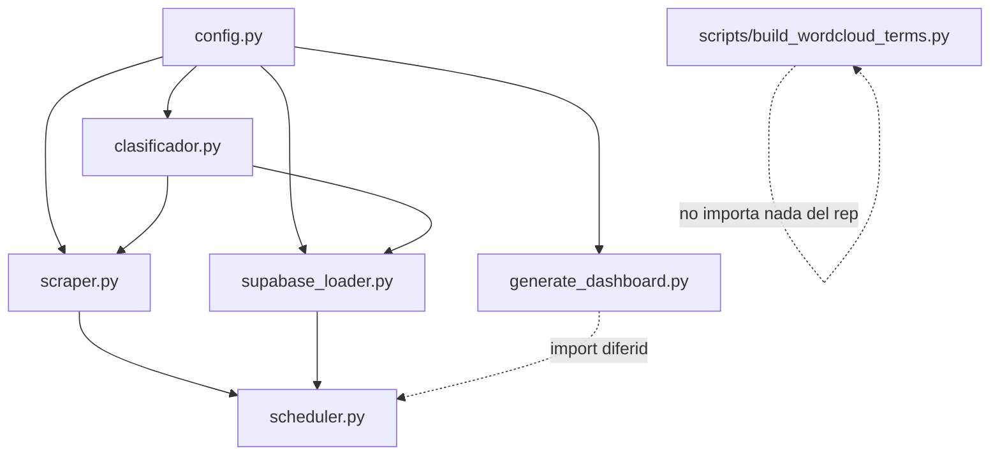
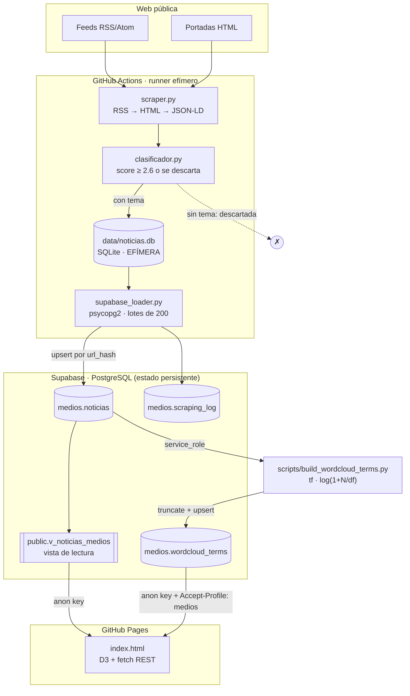

# Arquitectura de `medios-odesocan`

Índice de referencia del observatorio de medios canarios de ODESOCAN.
Escrito para leerse sin conocimiento previo del repositorio: describe qué hace
cada fichero, cómo circulan los datos, qué vive dentro del repositorio y qué
vive fuera (Supabase, GitHub Actions).

Última revisión del código analizado: rama `main`, commit `7426db2`.

---

## 1. Qué es este proyecto en una frase

Un **pipeline de observación de prensa**: cada día raspa 14 cabeceras canarias,
clasifica cada noticia en 15 temas de política social mediante un clasificador
híbrido (keywords + lemas + URL + similitud vectorial), vuelca lo nuevo a una
base PostgreSQL alojada en Supabase, y lo publica en un dashboard estático D3
servido por GitHub Pages que consulta esa base desde el propio navegador.

Un solo `git push` no despliega nada: **el repositorio es a la vez el código,
el planificador (cron de Actions) y el frontend**. La base de datos es el único
componente con estado y es externa.

---

## 2. Mapa de ficheros

El repositorio son 15 ficheros versionados. No hay tests, no hay paquete
instalable, no hay `src/`: todos los módulos Python viven en la raíz y se
importan entre sí por nombre plano.

| Fichero | Líneas | Capa | Rol |
|---|---:|---|---|
| `config.py` | 697 | Configuración | Única fuente de verdad: 14 medios, 15 temas, parámetros del scraper, credenciales por variable de entorno. Todo lo demás lo importa. |
| `scraper.py` | 934 | Recolección | Descarga RSS + portadas HTML, extrae artículos, escribe en SQLite. Contiene el esquema de la BD local. |
| `clasificador.py` | 303 | Clasificación | Asigna temas a cada noticia. Multietiqueta, con umbral de score. |
| `supabase_loader.py` | 377 | Persistencia | Sincroniza SQLite → PostgreSQL (Supabase) por conexión directa `psycopg2`. |
| `scheduler.py` | 102 | Orquestación | Encadena las tres fases anteriores. Es el entrypoint del workflow diario. |
| `generate_dashboard.py` | 230 | Presentación | **Legado funcional.** Inyectaba datos estáticos en `index.html`; hoy no encuentra nada que reescribir y devuelve `False`. |
| `index.html` | 1 319 | Presentación | Dashboard D3 autónomo. Consulta Supabase por REST desde el navegador. |
| `scripts/build_wordcloud_terms.py` | 390 | Agregación | Segundo pipeline, independiente: calcula el agregado textual de la nube de palabras. |
| `supabase/wordcloud.sql` | 96 | Esquema | DDL de `medios.wordcloud_terms`, su RLS y la función de truncado. |
| `.github/workflows/scraping.yml` | — | Orquestación | Cron diario 10:00 UTC → `scheduler.py --run-now`. |
| `.github/workflows/build-wordcloud.yml` | — | Orquestación | Cron diario 12:00 UTC → `build_wordcloud_terms.py`. |
| `requirements-ci.txt` | — | Entorno | Dependencias del pipeline principal (scraping + NLP). |
| `requirements.txt` | — | Entorno | Solo `supabase==2.15.3`, lo único que necesita el pipeline de la nube. |
| `README.md` | — | Documentación | Estado operativo, secrets, decisiones de diseño. |
| `.gitignore` | — | — | Excluye `data/`, `logs/`, `.env`, `.claude/`. |

### Grafo de importaciones



Dos observaciones sobre este grafo:

- **`config.py` es el cuello de botella deliberado.** Añadir un medio o un tema
  es editar un diccionario, nada más.
- **`build_wordcloud_terms.py` está aislado.** No importa `config.py` ni
  `clasificador.py`: se configura íntegramente por variables de entorno y habla
  con Supabase por su cliente REST, no por `psycopg2`. Es un pipeline paralelo
  que casualmente vive en el mismo repositorio, no una etapa del principal.

---

## 3. Flujo de datos completo



### El punto clave que hay que entender

**SQLite es efímera en producción.** `data/noticias.db` está en `.gitignore` y el
runner de Actions se destruye al terminar. Es decir: cada ejecución diaria
arranca con una base local **vacía**, raspa, clasifica, y sincroniza contra
Supabase preguntando primero qué `url_hash` ya existen allí
(`supabase_loader.py:75`). La deduplicación real es contra Postgres, no contra
la base local. En desarrollo local, en cambio, la SQLite sí persiste entre
ejecuciones y actúa como caché.

---

## 4. Las cuatro capas, en detalle

### 4.1 Recolección — `scraper.py`

Estrategia en cascada, de más fiable a más frágil:

1. **RSS** (`parsear_rss`, línea 410) — doble intento: primero `feedparser`
   directo con cabeceras de navegador, y si falla o devuelve 0 entradas,
   `httpx` como respaldo. Solo 5 de los 14 medios tienen RSS utilizable.
2. **Portada HTML** (`parsear_html_portada`, línea 562) — selectores CSS
   definidos por medio en `config.py`, con filtrado de URLs por regex.
3. **JSON-LD de la portada** (`_extraer_desde_jsonld_portada`, línea 495) — red
   de seguridad: si los selectores CSS devuelven menos de la mitad de la cuota,
   se buscan bloques `ItemList` / `NewsArticle` en los datos estructurados. Esto
   es lo que salva al scraper cuando un medio cambia de plantilla.
4. **Texto completo del artículo** (`extraer_texto_articulo`, línea 664) —
   `articleBody` de JSON-LD → `newspaper3k` → heurística con BeautifulSoup.
   Solo se descarga **después** de que la noticia haya pasado el filtro
   temático, para no gastar peticiones en artículos que se van a descartar.

**Dos clientes HTTP intercambiables por duck-typing** (ambos exponen `.get(url)`):

- `ClienteHTTP` (línea 222) — `httpx` con caché en disco (`data/html_cache/`,
  TTL 7 días), reintentos exponenciales, rotación de 12 User-Agents y
  *stale-if-error* (sirve caché caducada antes de rendirse).
- `ClientePlaywright` (línea 314) — Chromium headless. Lo usa **un solo medio**:
  `canariasahora`, que renderiza con JavaScript (`config.py:144`).

**Cortesía deliberada**: pausas aleatorias de 1,5–5 s entre peticiones, con un
12 % de probabilidad de una pausa larga de 8–22 s que imita a un lector humano
(`_esperar`, línea 154). `robots.txt` está **desactivado** por decisión explícita
(`config.py:647`): monitoreo académico, una ejecución diaria, menos tráfico que
un lector real. Es una decisión defendible pero conviene saberla.

### 4.2 Clasificación — `clasificador.py`

No es un modelo entrenado: es un **sistema de puntuación híbrido con cuatro
señales**, todas sumando al mismo score por tema.

| Señal | Peso | Dónde |
|---|---|---|
| Keyword literal en el título | `peso_titulo` del tema (2–4) | `_score_pista`, línea 186 |
| Keyword literal en el resumen | 1,15 | id. |
| Coincidencia por lemas (spaCy) en vez de literal | × 0,55 (× 0,75 si es multipalabra) | id. |
| Pistas extra de lenguaje periodístico | `peso_titulo + 0,8` | `EXTRA_THEME_HINTS`, línea 34 |
| Segmento de URL exacto (`/migraciones/`) | 2,4 | `_score_url`, línea 205 |
| Substring en el path de la URL | 1,4 | id. |
| Similitud vectorial con prototipo del tema | `(sim − 0,64) × 4` si `sim ≥ 0,64` | línea 285 |
| Bonus por ≥ 2 señales independientes | +0,35 | línea 282 |

**Umbral**: `SCORE_MINIMO = 2.6`, rebajado a 2,2 si la URL da una pista fuerte
(`clasificador.py:292`). Es multietiqueta: una noticia puede quedar en varios
temas ordenados por score.

**Consecuencia de diseño con peso metodológico**: una noticia sin ningún tema
por encima del umbral **no se guarda** (`scraper.py:119`, `guardar_noticia`
devuelve `False`) y, si ya estaba, se purga (`_purgar_noticias_sin_temas`,
`supabase_loader.py:131`). El corpus no es «la prensa canaria», es «la prensa
canaria filtrada por la agenda temática de ODESOCAN». Cualquier análisis de
volumen debe declararlo.

El prototipo de cada tema se construye concatenando `label` + `keywords` +
`EXTRA_THEME_HINTS` y vectorizándolo con `es_core_news_md`
(`_doc_prototipo`, línea 226). Si spaCy no está o no tiene vectores, esa señal
simplemente no suma y el clasificador degrada a keywords + URL.

### 4.3 Persistencia — `supabase_loader.py`

```
SQLite local ──► lee url_hash ya presentes en Postgres ──► envía solo lo nuevo
                 (lotes de 200, ON CONFLICT (url_hash) DO NOTHING)
```

Tres funciones públicas:

- `sincronizar()` (línea 154) — el volcado principal. Devuelve
  `{total_locales, eliminadas, pendientes, insertadas, errores}`.
- `sincronizar_log()` (línea 300) — copia `scraping_log` con `status = 'ok'`,
  deduplicando por timestamp de inicio truncado a segundos.
- `actualizar_temas_vacios()` (línea 256) — reclasifica en Postgres los
  registros con `temas IS NULL` y borra los que sigan sin tema. **No se invoca
  desde `scheduler.py`**: solo desde la CLI (`python supabase_loader.py`).

La conexión es **Postgres directo con `psycopg2`**, no el cliente REST de
Supabase. Va contra el *pooler* (`aws-1-eu-west-1.pooler.supabase.com:5432`).

### 4.4 Presentación — `index.html`

Un único fichero de 1 319 líneas, sin build step. Dependencias por CDN: D3 7.8.5
y el cliente `supabase-js` (cargado pero, en la práctica, no usado: todo el
acceso a datos son `fetch` a mano contra PostgREST).

**Arranque** (línea 1296): `fetchNoticias()` → `buildAggregates()` →
`buildDynamicUI()` → `redraw()`.

- `fetchNoticias()` (línea 644) pagina la vista `v_noticias_medios` de 1 000 en
  1 000 y descarga **todas** las noticias al navegador.
- `buildAggregates()` (línea 670) calcula en cliente los cinco arrays que
  alimentan los gráficos: `NW` (noticias), `MM` (por medio), `TM` (por tema),
  `HM` (matriz medio × tema), `TD` (actividad horaria).
- Todos los filtros son **client-side**: no hay una segunda petición al cambiar
  de medio o de tema.

**Seis visualizaciones**, todas D3 sobre SVG:

| Función | Gráfico | Interacción |
|---|---|---|
| `drawB()` línea 846 | Barras por medio | Clic filtra por medio |
| `drawL()` línea 872 | Líneas de actividad horaria | — |
| `drawT()` línea 902 | Barras por tema | Clic filtra por tema |
| `drawH()` línea 931 | Heatmap medio × tema | Clic filtra por ambos |
| `drawWC()` línea 1105 | Nube de palabras | — |
| `drawTB()` línea 1198 | Tabla paginada (8/página) | — |

**La nube de palabras es la excepción arquitectónica.** Es el único componente
que no se calcula sobre los datos ya descargados: pide bajo demanda el ámbito
correspondiente a `medios.wordcloud_terms` (`fetchWordcloudTerms`, línea 1060),
lo cachea en `WC_TERMS.cache`, y si la petición falla o el ámbito está vacío
recae en un cálculo en cliente sobre los titulares (`wcDesdeTitulares`, línea
1081) indicándolo en el subtítulo de la tarjeta. Razón: el agregado pondera el
**artículo completo**, que no viaja al navegador; los titulares sí.

El `scope_key` que pide se deriva de los filtros activos y coincide exactamente
con el que genera el pipeline Python (`wcScopeKey` línea 1051 ↔ `make_scope_key`
línea 256 de `build_wordcloud_terms.py`). Son dos implementaciones de la misma
convención en dos lenguajes: **si se cambia una, hay que cambiar la otra**.

---

## 5. Modelo de datos

### 5.1 SQLite local — `data/noticias.db`

Definida en `scraper.py:57` (`init_db`). Efímera en CI, persistente en local.

**`noticias`**

| Columna | Tipo | Notas |
|---|---|---|
| `id` | INTEGER PK | autoincremental |
| `url` | TEXT UNIQUE | |
| `url_hash` | TEXT UNIQUE | SHA-256 de la URL, truncado a 16 caracteres |
| `medio` | TEXT | clave de `MEDIOS` en `config.py` |
| `titulo` | TEXT NOT NULL | |
| `resumen` | TEXT | máx. 800 caracteres |
| `texto_full` | TEXT | máx. 5 000 caracteres |
| `fecha_pub` | TEXT | ISO 8601; en scraping HTML es la hora del raspado, no la de publicación real |
| `fecha_scrap` | TEXT NOT NULL | ISO 8601 UTC |
| `fuente` | TEXT | `'rss'` o `'html'` |
| `raw_json` | TEXT | payload original del feed o procedencia del extractor |
| `temas` | TEXT | array JSON de claves de tema |

Índices sobre `medio`, `fecha_pub`, `url_hash`. `PRAGMA journal_mode=WAL`.

**`scraping_log`**: `medio`, `inicio`, `fin`, `total`, `nuevas`, `errores`,
`status` (`running` | `ok` | `error`). Es la traza de auditoría de cada
ejecución por medio.

### 5.2 PostgreSQL / Supabase — proyecto `kdpsjutsgvghdtzoskkg`

| Objeto | Esquema | Origen del DDL | Quién escribe | Quién lee |
|---|---|---|---|---|
| `noticias` | `medios` | ⚠️ **no versionado** | `supabase_loader.py` (usuario Postgres) | vista + pipeline de nube |
| `scraping_log` | `medios` | ⚠️ **no versionado** | `supabase_loader.py` | — |
| `v_noticias_medios` | `public` | ⚠️ **no versionado** | — | `index.html` con la *anon* key |
| `wordcloud_terms` | `medios` | ✅ `supabase/wordcloud.sql` | `build_wordcloud_terms.py` (*service_role*) | `index.html` con la *anon* key |
| `truncate_wordcloud_terms()` | `public` | ✅ `supabase/wordcloud.sql` | — | solo *service_role* |

**`medios.wordcloud_terms`** — clave primaria compuesta
`(scope_key, gram_type, normalized_term)`; columnas `medio`, `tema`, `term`,
`score`, `doc_freq`, `term_freq`, `sample_titles` (jsonb, hasta 3 titulares de
ejemplo), `n_noticias`, `generated_at`.

**Cuatro ámbitos precalculados** (`scope_keys`, línea 245):

| `scope_key` | Significado |
|---|---|
| `__all__` | corpus completo |
| `medio:canarias7` | un medio, todos los temas |
| `tema:vivienda` | un tema, todos los medios |
| `medio:canarias7\|tema:vivienda` | la celda cruzada |

**Cálculo del score**: `tf · log(1 + N/df)` donde `tf` pondera el campo de
origen — `titulo` ×3, `resumen` ×2, `texto_full` ×1 — y los bigramas reciben un
×1,15 adicional (`weighted_terms`, línea 231). Se conservan los 80 términos con
más score por ámbito, exigiendo `doc_freq ≥ 2`.

**Notas de seguridad que el propio SQL documenta** (`supabase/wordcloud.sql`):

- La *anon* key está en `index.html`, en un repositorio público. Es su función
  —es una clave pública—, pero implica que todo lo que `anon` pueda hacer, lo
  puede hacer cualquiera.
- Por eso `truncate_wordcloud_terms()`, que es `SECURITY DEFINER` y recibe
  esquema y tabla por parámetro (**puede truncar cualquier tabla de la base**),
  tiene el `EXECUTE` revocado explícitamente a `anon` y a `authenticated`, no
  solo a `PUBLIC`. Supabase concede `EXECUTE` por defecto a esos roles sobre
  funciones nuevas de `public`. **Si la función se recrea, hay que volver a
  revocarlo.**
- El esquema `medios` se creó sin `USAGE` para `service_role`; el fichero lo
  concede. `BYPASSRLS` salta las políticas RLS, no los `GRANT`.

---

## 6. Inventario de configuración

### 6.1 Los 14 medios (`config.py:28`)

| Clave | Nombre | Tipo | Cuota | Particularidad |
|---|---|---|---:|---|
| `canarias7` | Canarias7 | rss+html | 30 | |
| `laprovincia` | La Provincia | html_only | 30 | RSS da 404; regex de URL por fecha |
| `eldia` | El Día | html_only | 30 | misma plataforma que La Provincia |
| `diariodeavisos` | Diario de Avisos | rss+html | 30 | WordPress; migró de Astra a Kadence |
| `laopinion` | La Opinión de Tenerife | html_only | 25 | el RSS redirige al grupo editorial |
| `elpueblocanario` | El Pueblo Canario | html_only | 25 | ⚠️ **ECONNREFUSED persistente, 0 noticias históricas** |
| `canariasnoticias` | Canarias Noticias | html_only | 25 | ⚠️ **ECONNREFUSED persistente, 0 noticias históricas** |
| `canariasahora` | Canarias Ahora | html_only | 25 | **único medio con Playwright** (renderiza con JS) |
| `atlanticohoy` | Atlántico Hoy | html_only | 25 | |
| `eltime` | El Time | html_only | 25 | |
| `gomeraverde` | Gomera Verde | rss+html | 25 | |
| `lancelotdigital` | Lancelot Digital | rss+html | 25 | excluye `/component/` |
| `elhierrohoy` | El Hierro Hoy | rss+html | 20 | excluye taxonomías de WordPress |
| `lavozdefuerteventura` | La Voz de Fuerteventura | rss+html | 25 | |

Cada entrada define `nombre`, `color`, `url`, `rss[]`, `tipo`, `max_items`,
`selectores.{titular,resumen}` y, opcionalmente, `html_url_regex`,
`html_url_excludes` y `playwright`.

### 6.2 Los 15 temas (`config.py:281`)

| Clave | Etiqueta | Keywords | `peso_titulo` |
|---|---|---:|---:|
| `migracion` | Migración | 38 | 3 |
| `economia` | Economía | 36 | 3 |
| `presupuestos` | Presupuestos | 30 | 3 |
| `violencia_genero` | Violencia de género | 25 | **4** |
| `politica` | Política | 30 | 2 |
| `medio_ambiente` | Medio ambiente | 31 | 2 |
| `vivienda` | Vivienda | 30 | 3 |
| `sanidad` | Sanidad | 29 | 3 |
| `salud_mental` | Salud mental | 28 | **4** |
| `turismo` | Turismo | 32 | 3 |
| `dependencia_discapacidad` | Dependencia y Discapacidad | 27 | 3 |
| `justicia` | Justicia | 40 | 3 |
| `diversidad` | Diversidad | 34 | 3 |
| `cuidados` | Cuidados | 33 | 3 |
| `igualdad` | Igualdad | 33 | 3 |

`peso_titulo = 4` en `violencia_genero` y `salud_mental` significa que una sola
keyword en el título ya supera el umbral de 2,6: son temas donde se prioriza no
perder cobertura frente a algún falso positivo.

### 6.3 Parámetros del scraper (`config.py:631`)

`delay_min` 1,5 s · `delay_max` 5,0 s · `pausa_larga_prob` 0,12 ·
`pausa_larga_rango` (8, 22) s · `timeout` 15 s · `max_reintentos` 3 ·
`max_items_por_medio` 50 · `cache_ttl_dias` 7 · `respetar_robots` **False**.

---

## 7. Orquestación y entorno

### 7.1 Los dos workflows

| Workflow | Cron (UTC) | Ejecuta | Dependencias |
|---|---|---|---|
| `scraping.yml` | `0 10 * * *` | `python scheduler.py --run-now` | `requirements-ci.txt` + Playwright + `es_core_news_md` |
| `build-wordcloud.yml` | `0 12 * * *` | `python scripts/build_wordcloud_terms.py` | `requirements.txt` (solo `supabase`) |

GitHub encola los `schedule` con retraso variable: la hora real de arranque
puede desplazarse horas. Está documentado en ambos ficheros y en el README como
comportamiento de plataforma, no como fallo.

### 7.2 Secrets y variables

**Pipeline de scraping** — conexión Postgres directa:
`SUPABASE_HOST`, `SUPABASE_PORT`, `SUPABASE_DBNAME`, `SUPABASE_USER`,
`SUPABASE_PASSWORD`, `SUPABASE_SSLMODE`, `SUPABASE_SCHEMA`.

**Pipeline de nube de palabras** — cliente REST:
`SUPABASE_URL`, `SUPABASE_SERVICE_ROLE_KEY` (la *service_role*, **nunca** la
*anon*: el script escribe y necesita saltarse RLS).

**Variables opcionales de repositorio** (con estos valores por defecto):
`SUPABASE_SOURCE_SCHEMA` = `medios` · `SUPABASE_SOURCE_TABLE` = `noticias` ·
`SUPABASE_TARGET_SCHEMA` = `medios` · `SUPABASE_TARGET_TABLE` =
`wordcloud_terms` · `WORDCLOUD_MAX_TERMS` = `80` · `WORDCLOUD_MIN_DOC_FREQ` = `2`.

### 7.3 Filosofía de errores: los fallos son silenciosos por diseño

Es lo más importante que hay que saber para operar esto, y es contraintuitivo:

- **`scheduler.py` captura las excepciones de cada fase y las registra sin
  propagarlas** (líneas 50, 60, 73). Un fallo de sincronización con Supabase
  **no** pone el workflow en rojo. Si algo va mal se ve en el log del job, nunca
  en el aspa de Actions.
- **`build-wordcloud.yml` comprueba los secrets antes de ejecutar** y, si
  faltan, omite el paso y termina en verde explicando el motivo en el resumen
  del job (`GITHUB_STEP_SUMMARY`), en lugar de fallar a diario.
- **El paso de commit no falla si no hay cambios**
  (`git diff --staged --quiet || git commit`).

Corolario operativo: **un ✅ verde en Actions no significa que haya entrado un
solo dato**. Para verificar hay que mirar el log del job, o contar filas en
`medios.noticias`.

### 7.4 Ejecución local

```bash
pip install -r requirements-ci.txt
python -m spacy download es_core_news_md

python scraper.py --lista-medios          # inventario de medios configurados
python scraper.py -m canarias7 --dry-run  # un medio, sin escribir en BD
python scheduler.py --run-now             # pipeline completo
python supabase_loader.py --dry-run       # ver qué se enviaría
python generate_dashboard.py --dry-run
python scripts/build_wordcloud_terms.py   # requiere SUPABASE_URL y SERVICE_ROLE_KEY
```

---

## 8. Dónde tocar según qué se quiera cambiar

| Objetivo | Fichero y sitio |
|---|---|
| Añadir un medio | `config.py` → diccionario `MEDIOS` (+ `LM` y `MEDIO_COLORS` en `index.html`) |
| Añadir o afinar un tema | `config.py` → `TEMAS`; pistas extra en `clasificador.py:34`; pistas de URL en `clasificador.py:102` |
| Cambiar la sensibilidad del clasificador | `clasificador.py:30` (`SCORE_MINIMO`) y los `peso_titulo` de `config.py` |
| Un medio dejó de devolver titulares | `selectores` del medio en `config.py`; comprobar si el JSON-LD lo está salvando en el log |
| Cambiar la cadencia del scraping | `.github/workflows/scraping.yml` → `cron` (y `scheduler.py:95` para el modo daemon) |
| Limpiar palabras vacías de la nube | `SPANISH_STOPWORDS` en `scripts/build_wordcloud_terms.py:62` |
| Cambiar cuántos términos guarda la nube | variable de repositorio `WORDCLOUD_MAX_TERMS` |
| Modificar un gráfico | la función `drawX()` correspondiente en `index.html` (tabla del §4.4) |
| Cambiar la paleta | `MEDIO_COLORS` / `TEMA_COLORS` en `index.html:590` **y** `config.py` (están duplicadas) |
| Añadir una columna a la nube | `supabase/wordcloud.sql` + `build_aggregates()` + `fetchWordcloudTerms()` |

---

## 9. Observaciones sobre el estado del código

Hallazgos de la lectura, ordenados por lo que más afecta a un uso analítico.
Ninguno impide que el sistema funcione hoy.

1. **El DDL de las tablas principales no está versionado.** `medios.noticias`,
   `medios.scraping_log` y la vista `public.v_noticias_medios` solo existen
   dentro del proyecto Supabase. Únicamente `wordcloud_terms` tiene su SQL en el
   repositorio. Si el proyecto se perdiera, el esquema habría que reconstruirlo
   por ingeniería inversa desde `supabase_loader.py`. Es la fragilidad más
   relevante para reproducibilidad.

2. **`fecha_pub` no es comparable entre fuentes.** En RSS viene del feed; en
   scraping HTML se rellena con `datetime.now()` del momento del raspado
   (`scraper.py:624` y `:532`). Como el dashboard construye el gráfico de
   actividad horaria (`TD`) sobre `fecha_pub`, para los 9 medios sin RSS ese
   gráfico mide **cuándo se ejecutó el scraper**, no cuándo publicó el medio.
   Cualquier análisis temporal debería restringirse a `fuente = 'rss'` o usar
   `fecha_scrap` explícitamente.

3. **El inventario de medios está duplicado y desincronizado.** `config.py`
   define 14; `index.html` (`LM`, `MEDIO_COLORS`) conoce 12. Faltan
   `elpueblocanario` y `canariasnoticias` — precisamente los dos con
   ECONNREFUSED y 0 noticias históricas, así que hoy no se nota. Si volvieran a
   responder, aparecerían en el dashboard con su clave técnica y un color del
   fallback. Además, dos colores no coinciden entre ambos ficheros
   (`gomeraverde`, `lavozdefuerteventura`).

4. **`index.html` descarga el corpus entero al navegador** en páginas de 1 000
   filas. Con ~12 700 noticias son 13 peticiones en cada carga. Es sostenible
   ahora; a 50 000 filas dejará de serlo, y el arreglo natural sería mover los
   agregados a vistas materializadas en Postgres — el mismo patrón que ya usa la
   nube de palabras.

5. **`generate_dashboard.py` es código muerto que se conserva a propósito.** El
   README lo explica: ya no encuentra el bloque estático que reescribía y
   devuelve `False`. Está bien señalizado, pero son 230 líneas y una dependencia
   de `scheduler.py` que pueden confundir a quien llegue nuevo.

6. **`actualizar_temas_vacios()` no forma parte del pipeline automático.** Solo
   se ejecuta desde la CLI. Si alguna vez entra un registro con `temas IS NULL`,
   nada lo reclasifica de forma programada.

7. **`index.html` termina con `</body></html>` duplicado** (líneas 1317-1319).
   Los navegadores lo toleran; es un residuo de edición.

8. **Carga `supabase-js` por CDN sin usarlo.** Todo el acceso a datos son
   `fetch` manuales contra PostgREST. Es una descarga inútil en cada visita.

9. **El paso «Commit y push del dashboard» hace `git add index.html data/`**,
   pero `data/` está íntegramente en `.gitignore`. En la práctica ese paso no
   commitea nada casi nunca, lo cual es coherente con que el dashboard ya no se
   regenere.

---

## 10. Glosario de orientación desde R

Equivalencias aproximadas para leer el código sin fricción.

| Aquí (Python / SQL / JS) | Equivalente mental en R |
|---|---|
| `config.py` con diccionarios `MEDIOS` / `TEMAS` | un `config.yml` o una `list()` con nombres en un script de constantes |
| `dict` | `list()` con nombres, o un entorno |
| `defaultdict(int)` / `Counter` | `table()`, o `tapply` acumulando |
| `dataclass NewsItem` | una fila de `data.frame` con clase propia (`vctrs::new_rcrd`) |
| `@lru_cache` | `memoise::memoise()` |
| `psycopg2` + `execute_values` | `DBI::dbWriteTable()` / `dbAppendTable()` en lotes |
| `ON CONFLICT (url_hash) DO NOTHING` | un `anti_join()` por clave antes de insertar |
| `feedparser` | `tidyRSS::tidyfeed()` |
| `BeautifulSoup` + selectores CSS | `rvest::html_elements()` |
| `spaCy` (lemas, vectores) | `udpipe` o `spacyr` |
| `tf · log(1 + N/df)` | TF-IDF; `tidytext::bind_tf_idf()` |
| D3 `.data().join()` | la gramática de capas de `ggplot2`, pero imperativa |
| GitHub Actions cron | `cronR` o un `targets` pipeline programado |

**Para consultar los datos directamente desde R** (mismo *pooler* que usa
`supabase_loader.py`, credenciales en `.Renviron`):

```r
con <- DBI::dbConnect(
  RPostgres::Postgres(),
  host     = Sys.getenv("SUPABASE_HOST"),
  port     = 5432,
  dbname   = "postgres",
  user     = Sys.getenv("SUPABASE_USER"),
  password = Sys.getenv("SUPABASE_PASSWORD"),
  sslmode  = "require"
)

noticias <- DBI::dbGetQuery(con, "
  SELECT medio, titulo, temas, fuente, fecha_pub, fecha_scrap
  FROM   medios.noticias
")

# `temas` llega como array de Postgres: una fila por par noticia-tema
library(dplyr); library(tidyr)
largo <- noticias |> unnest_longer(temas)
```

Ojo con dos cosas al analizar: `temas` es un array (una noticia cuenta en varios
temas, así que los totales por tema **suman más** que el número de noticias), y
`fecha_pub` solo es fiable donde `fuente = 'rss'` (§9.2).

---

## 11. Resumen para tenerlo en la cabeza

- **Un repositorio, dos pipelines independientes** que se cruzan solo en la base
  de datos.
- **El estado vive fuera**: Supabase es la única pieza persistente; SQLite es un
  búfer efímero y el HTML no guarda nada.
- **`config.py` gobierna la recolección; `wordcloud.sql` gobierna el agregado
  textual; el resto es plomería.**
- **Los fallos son verdes por diseño**: hay que leer los logs, no los iconos.
- **El corpus está filtrado por tema en origen**: no es una muestra de la prensa
  canaria, es la prensa canaria proyectada sobre la agenda de ODESOCAN. Decláralo
  en cualquier análisis.
